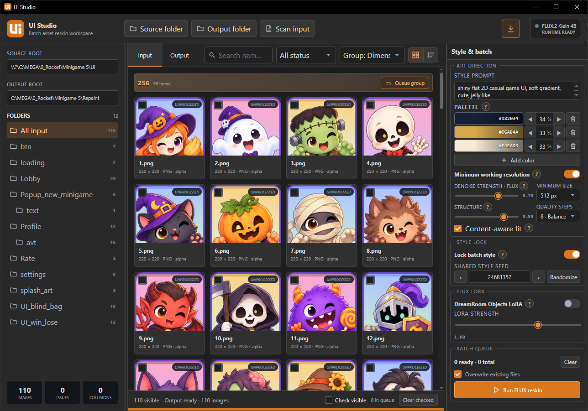
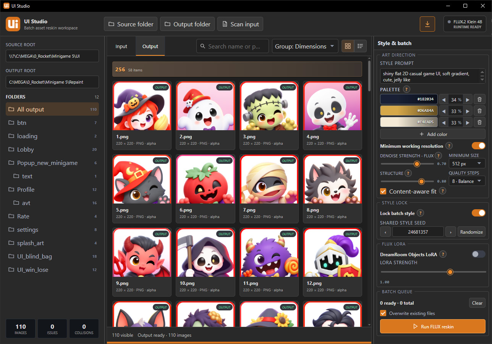
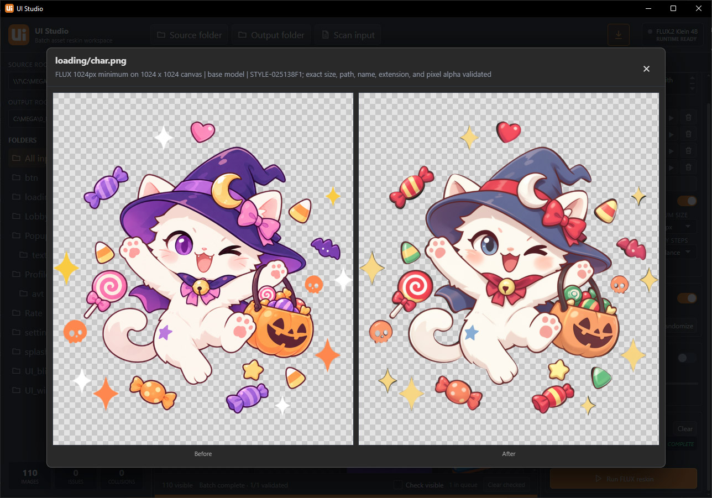
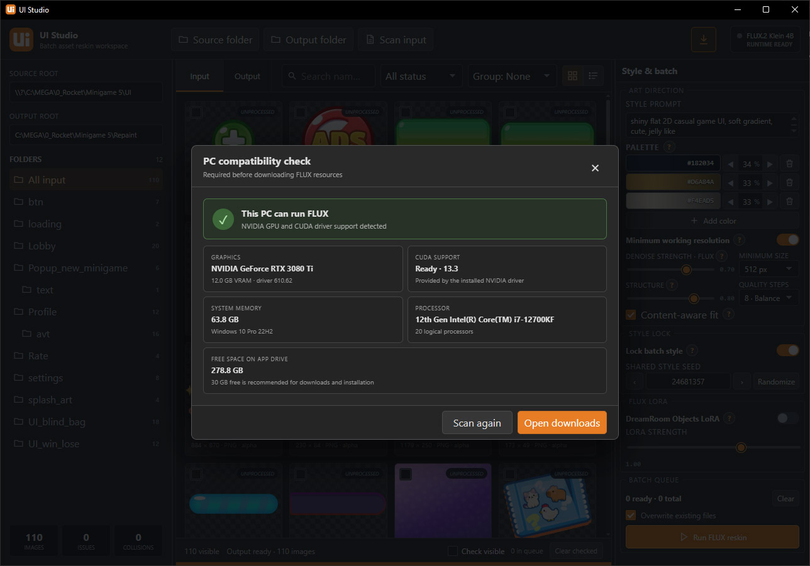

# UI Studio

<p align="center">
  
</p>

A portable Windows tool for batch-reskinning UI image assets with a consistent visual style.

It provides folder-based input and output browsing, style and palette controls, batch processing, and preservation of source filenames, folder structure, image dimensions, and transparency.

## Screenshots

<p align="center">
  
</p>

<table>
  <tr>
    <td width="50%"></td>
    <td width="50%"></td>
  </tr>
  <tr>
    <td colspan="2"></td>
  </tr>
</table>

## Run from source

```powershell
npm install
npm run tauri dev
```

## Portable build

```powershell
npm run tauri -- build --no-bundle
./tools/build_portable.ps1
```

The portable package starts with blank settings and downloads required processing resources through the app after checking system compatibility.
