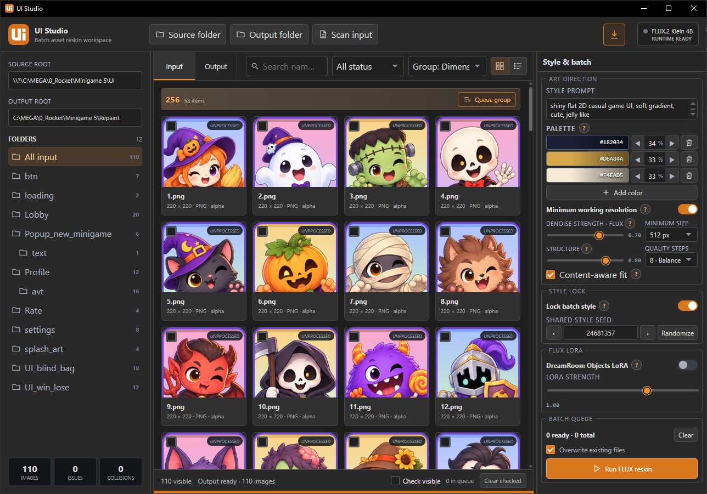
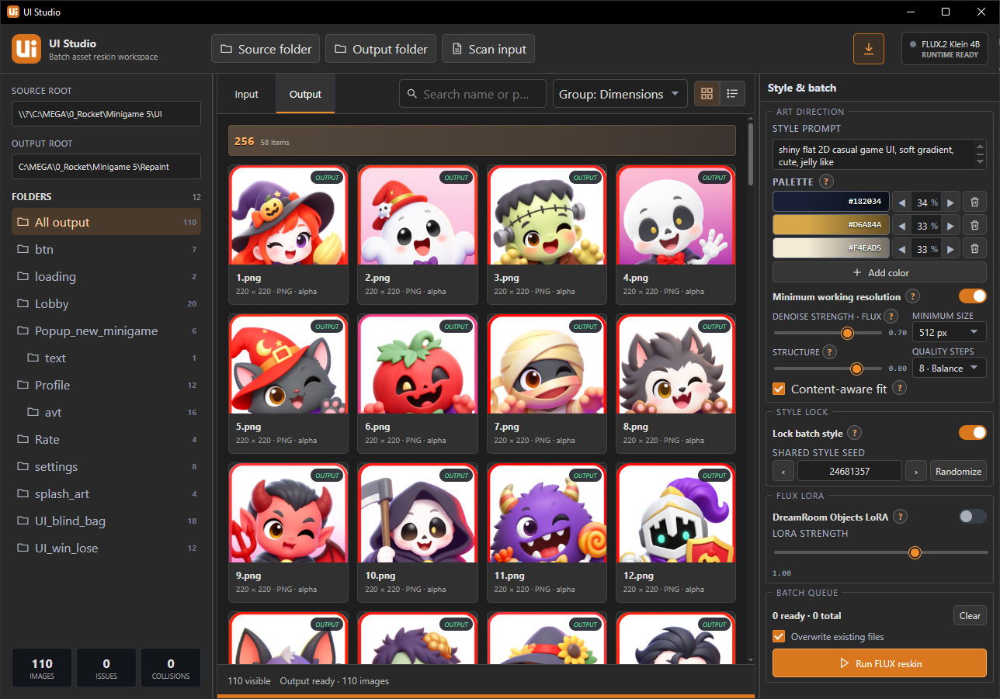
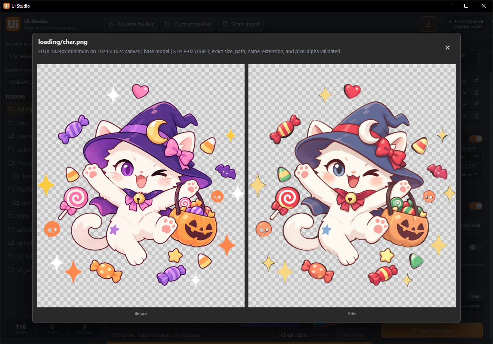
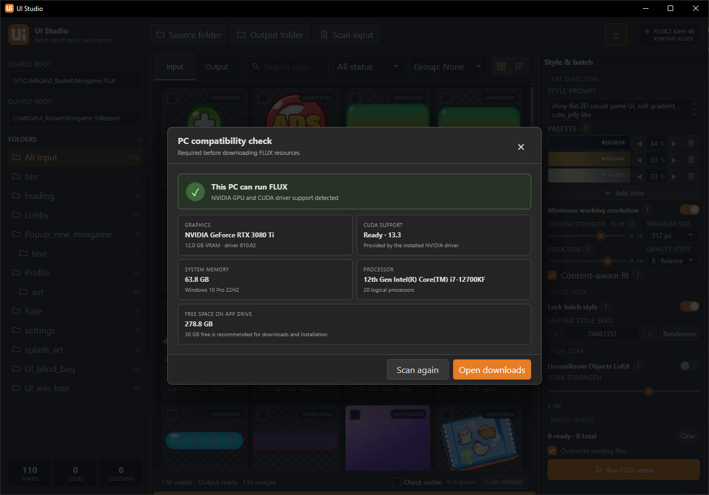

# UI Studio

<p align="center">
  
</p>

A portable Windows tool for batch-reskinning UI image assets with a consistent visual style.

It provides folder-based input and output browsing, style and palette controls, batch processing, and preservation of source filenames, folder structure, image dimensions, and transparency. Processing can run locally or through an optional cloud API mode.

## Processing modes

- **Local:** Runs the bundled FLUX workflow on a compatible NVIDIA GPU after the required resources are downloaded.
- **Cloud API:** Uses an OpenAI API key held only for the current app session. Local model downloads and CUDA are not required in this mode.

The automatic working-size option selects a suitable canvas tier for each source image. Fixed minimum tiers remain available for manually controlled batches.

## Screenshots

<p align="center">
  
</p>

<table>
  <tr>
    <td width="50%"></td>
    <td width="50%"></td>
  </tr>
  <tr>
    <td colspan="2"></td>
  </tr>
</table>

## Run from source

```powershell
npm install
npm run tauri dev
```

## Portable build

```powershell
npm run tauri -- build --no-bundle
./tools/build_portable.ps1
```

The portable package starts with blank settings and downloads required processing resources through the app after checking system compatibility.
